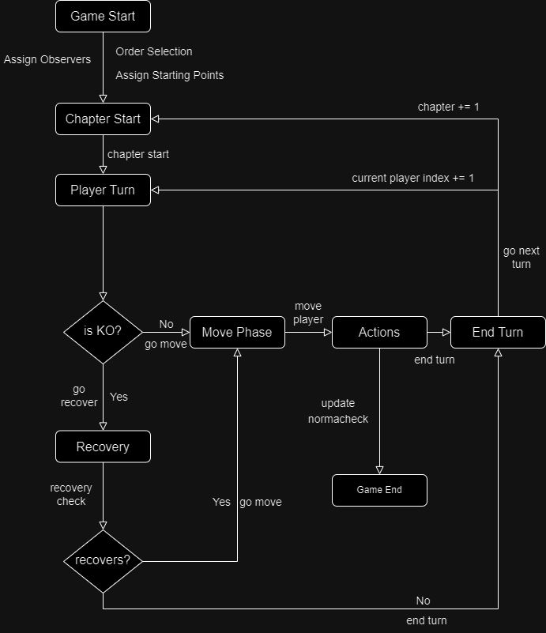

# 99.7% Citric Liquid

## About

`99.7% Citric Liquid` is a simplified clone of the renowned game, `100% Orange Juice`. Its main
purpose is to serve as an educational tool, teaching foundational programming concepts.

📢 **Note**: This project is purely educational and will not be used for any commercial purposes.

---

## Project

The implementation follows the MVC desigin pattern (model-view-controller).
The model and controller are fully implemented, but the view is still in progress.
Since the view is not implemented all events that require user input are replaced by a random selection.

The model implementation consists in the following packages:

### Board

here is implemented the trait Panel and the abstract class GamePanel that extends Panel.
these two act as a base to create all the classes that are going to be used.
the panels implemented are NeutralPanel, HomePanel, DropPanel, EncounterPanel and BonusPanel.
each one of them has an unique effect when a player activates it.
aditionally there is an object GameBoard that creates an Array[Array[Panel]] that acts as a board.
the board in GameBoard is pre-defined and ressembles the map "Practice Field" from the original game.

### Character

The trait Units and the abstract class AbstractUnits are the base of the rest of the units.
PlayerCharacter is implemented as the playable character for the users.
there is aditional units implemented known as Wild Units that the players can fight during the game.
the Wild Units are pre-defined and there is three of them: RoboBall, Chicken and Seagull.

### Norma

Norma is the end goal of the game, there is six levels of norma and each one of them is a separate class that contains the requirements necessary to advance the norma level.
all of this is controlled by a NormaContoller.

The controller implementation consists in the class GameController and the following packages:

### States

#### State diagram

all the states are implemented in its own class.
an aditiona state is implemented called GameState that is used to create abstract implementations of all public methods used in the states. This is made in order to prevent methods being called in states that are not expected.

### Observer

the traits Observer and Observable are implemented, this is to make all the PlayerCharacters Observable and the GameController an Observer of all of them.
the idea is that a player reaching norma level 6 notifies the observer, which changes the state to the GameEndState, ending the game.

    

This project is licensed under the [Creative Commons Attribution 4.0 International License](http://creativecommons.org/licenses/by/4.0/).

---
